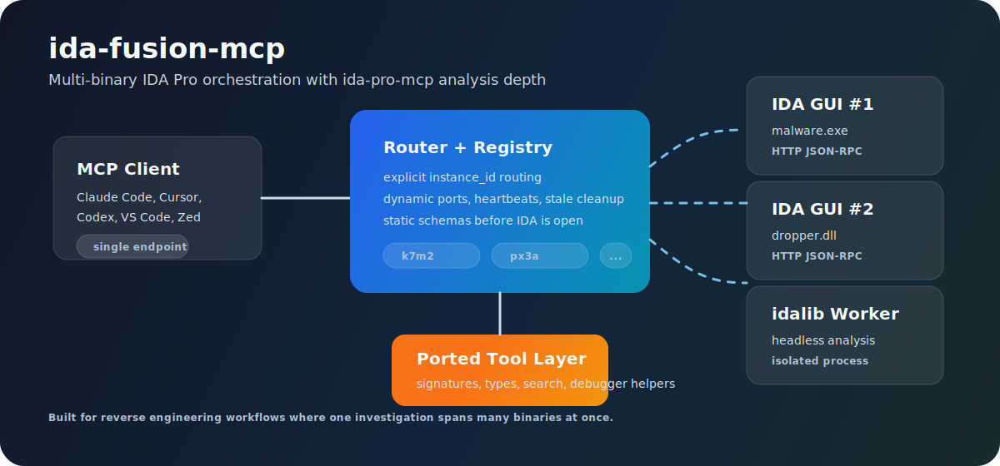

# ida-fusion-mcp

`ida-fusion-mcp` is a fork and continuation of [`MeroZemory/ida-multi-mcp`](https://github.com/MeroZemory/ida-multi-mcp). It keeps the original multi-instance IDA routing model, renames the public project, and adds a larger tool surface ported from [`ida-pro-mcp`](https://github.com/mrexodia/ida-pro-mcp).

The goal is straightforward: one MCP endpoint for reverse-engineering work that spans more than one IDA database. Your AI client keeps one stable server config, and each tool call is routed to the correct IDA Pro GUI instance or headless `idalib` worker by `instance_id`.

The project combines three things that are usually separate:

- multi-binary routing for loaders, payloads, plugins, services, and shared libraries;
- a broad IDA tool surface adapted from `ida-pro-mcp`;
- headless IDA Pro sessions for background analysis without opening another GUI window.




## What Problem It Solves

Most IDA MCP setups assume a single active database. That is awkward once an investigation needs context from several files at once: a dropper and payload, a patched and unpatched build, a client and server pair, or a main executable plus libraries.

`ida-fusion-mcp` makes the target explicit. The AI client first asks for registered instances, receives short IDs such as `k7m2` or `px3a`, and includes one of those IDs in every IDA tool call. That small constraint prevents a common failure mode: the model decompiles, renames, patches, or debugs the wrong database because two IDA windows are open.

## Core Ideas

| Idea | Practical effect |
|---|---|
| One MCP server | Configure Claude Code, Cursor, Codex, VS Code, or another MCP client once. |
| Many IDA backends | GUI IDA instances and headless `idalib` workers register into the same local registry. |
| Required `instance_id` | Tool calls are deliberately scoped to one database. |
| Static + dynamic schemas | Tools are visible before IDA is open, then refreshed from live IDA instances. |
| Local-only transport | IDA listens on loopback HTTP JSON-RPC; the MCP server talks stdio to the client. |
| Compatibility aliases | The public name is `ida-fusion-mcp`; the Python implementation package remains `ida_fusion_mcp` to avoid breaking existing imports. |

## Tool Surface

The IDA-side tools cover the normal reverse-engineering loop: discovery, navigation, decompilation, xrefs, memory reads, patching, type work, comments, stack variables, debugger access, and binary triage.

The recent port from `ida-pro-mcp` adds these higher-level capabilities:

| Category | Tools |
|---|---|
| Signature generation | `make_signature`, `make_signature_for_function`, `make_signature_for_range`, `find_xref_signatures` |
| Type catalog | `type_query`, `type_inspect`, `type_apply_batch` |
| Unified search | `entity_query`, `search_text` |
| IDAPython file execution | `py_exec_file` |
| Debugger helpers | `dbg_status`, `dbg_set_bp_condition`, `dbg_gpregs`, `dbg_gpregs_remote`, `dbg_regs_named`, `dbg_regs_named_remote` |

Router-level tools add multi-instance operations:

| Tool | Purpose |
|---|---|
| `list_instances` | Show every registered GUI or headless IDA backend. |
| `refresh_tools` | Refresh schemas from currently connected IDA instances. |
| `compare_binaries` | Compare metadata and segments from two registered instances. |
| `decompile_to_file` | Save decompiler output to disk without stuffing huge output into chat. |
| `get_cached_output` | Retrieve follow-up chunks from truncated large responses. |
| `idalib_open` / `idalib_close` / `idalib_list` / `idalib_status` | Manage headless IDA Pro sessions. |

## Comparison

| Capability | ida-fusion-mcp | ida-pro-mcp | Typical single-instance MCP |
|---|---|---|---|
| Multiple GUI IDA windows | First-class workflow | Not the main focus | Usually awkward |
| Per-call target selection | Required `instance_id` | Context/session dependent | Often implicit |
| Headless IDA Pro | Managed `idalib` workers in the same registry | `idalib-mcp` supervisor model | Often absent |
| Signature/type/search tools | Included from the port | Included upstream | Varies |
| Cross-binary helpers | Included at router level | Not the focus | Usually absent |
| Best fit | Multi-file investigations and agent workflows | Upstream single-database IDA tooling | One binary at a time |

## Quick Start

Install the package, install the IDA loader, then open binaries in IDA.

```bash
python -m pip install git+https://github.com/andsopwn/ida-fusion-mcp.git
ida-fusion-mcp --install
ida-fusion-mcp --list
```

Example client prompt:

```text
Call list_instances, identify the two open binaries, decompile their entry points, and compare the initialization paths.
```

The legacy `ida-multi-mcp` console command is still provided as an alias. New configuration uses `ida-fusion-mcp`.

## Installation Details

### Requirements

- Python 3.11 or newer for the MCP server.
- IDA Pro 8.3 or newer.
- IDA's embedded Python must also be able to import the installed package.
- `idalib` features require IDA Pro; IDA Home/Free do not provide headless `idalib`.

### macOS

IDA often uses a different Python build than your shell. Check IDA's Python first:

```python
import sys
print(sys.version)
```

Then install with the matching Python version:

```bash
pipx install git+https://github.com/andsopwn/ida-fusion-mcp.git
python3.11 -m pip install --user git+https://github.com/andsopwn/ida-fusion-mcp.git
ida-fusion-mcp --install
```

For Claude Code, a direct CLI registration is usually clearer than a module command:

```bash
claude mcp add ida-fusion-mcp -s user -- ida-fusion-mcp
```

### Windows

```powershell
py -3.11 -m pip install git+https://github.com/andsopwn/ida-fusion-mcp.git
ida-fusion-mcp --install
```

If IDA uses a different Python version, replace `3.11` with IDA's version. For a custom IDA directory:

```powershell
ida-fusion-mcp --install --ida-dir "C:\Program Files\IDA Professional 9.3"
```

### Linux

```bash
python3 -m pip install --user git+https://github.com/andsopwn/ida-fusion-mcp.git
ida-fusion-mcp --install
```

### Manual MCP Config

`ida-fusion-mcp --install` writes client configs automatically when it recognizes the client. To inspect the raw MCP config:

```bash
ida-fusion-mcp --config
```

Typical output:

```json
{
  "mcpServers": {
    "ida-fusion-mcp": {
      "command": "/path/to/python3",
      "args": ["-m", "ida_fusion_mcp"]
    }
  }
}
```

## Using It

Open one or more binaries in IDA Pro. The loader installed by `--install` starts an IDA-local HTTP server and registers the database in `~/.ida-mcp/instances.json`.

Check what is live:

```bash
ida-fusion-mcp --list
```

Then use the displayed `instance_id` in prompts or tool arguments:

```text
Use instance k7m2. Find functions referencing the string "license", decompile the callers, and summarize the validation path.
```

For two binaries:

```text
Use k7m2 as the old build and px3a as the patched build. Compare the functions around the entry point and report changed calls.
```

For headless work:

```text
Open /samples/payload.bin with idalib_open, wait for analysis, then run survey_binary on the returned instance.
```

## Architecture

```text
AI client
  |
  | MCP stdio
  v
ida-fusion-mcp router
  |-- local registry and schema cache
  |-- output cache for large responses
  |-- idalib worker manager
  |
  | HTTP JSON-RPC on loopback
  v
IDA GUI #1    IDA GUI #2    idalib worker #1
```

The router does not own IDA analysis state. It validates the requested `instance_id`, forwards the call to the matching backend, normalizes large outputs, and returns the MCP response to the client.

## Operational Notes

- The installed IDA loader is named `ida_fusion_mcp.py`.
- The implementation module remains `ida_fusion_mcp`.
- The registry lives under `~/.ida-mcp/` by default.
- GUI instances send heartbeats; stale entries are cleaned up.
- If an IDA window opens a different input file, the old instance expires and a new ID is registered.
- Debugger extension tools are available from the IDA-side MCP server with the debugger extension enabled; router schemas expose the callable tool names to clients.

## Troubleshooting

### IDA does not show the plugin

Check that the loader exists:

```bash
ls ~/.idapro/plugins/ida_fusion_mcp.py
```

On Windows:

```powershell
Get-Item "$env:APPDATA\Hex-Rays\IDA Pro\plugins\ida_fusion_mcp.py"
```

If IDA reports `No module named 'ida_fusion_mcp'`, install the package with the Python version used by IDA. If IDA itself is using Python older than 3.11, switch IDA to a supported Python build with `idapyswitch`.

### The MCP client starts the wrong Python

Run:

```bash
ida-fusion-mcp --config
```

If the generated command points to an unexpected interpreter, configure the client to call the `ida-fusion-mcp` CLI directly.

### No instances are listed

Start IDA with a binary loaded, then run:

```bash
ida-fusion-mcp --list
```

If the list is still empty, check the IDA output window for `[ida-fusion-mcp]` messages.

## Development

```bash
git clone https://github.com/andsopwn/ida-fusion-mcp.git
cd ida-fusion-mcp
python -m venv .venv
. .venv/bin/activate
python -m pip install -e ".[dev]"
python -m pytest -q
```

The public package exposes both commands:

```bash
ida-fusion-mcp --config
ida-multi-mcp --config   # compatibility alias
```

## Lineage And License

`ida-fusion-mcp` is MIT licensed. See [LICENSE](LICENSE).

This repository is based on and extends MIT-licensed work from:

- [`ida-multi-mcp`](https://github.com/MeroZemory/ida-multi-mcp), the original multi-instance IDA MCP router.
- [`ida-pro-mcp`](https://github.com/mrexodia/ida-pro-mcp), copyright (c) 2025 Duncan Ogilvie.
- [`ida-sigmaker`](https://github.com/mahmoudimus/ida-sigmaker), copyright (c) 2024 Mahmoud Abdelkader.

Those attributions are intentional: this project is `ida-multi-mcp` plus additional ported functionality, packaging the useful IDA tool surface into a router-oriented workflow for multi-binary analysis.
